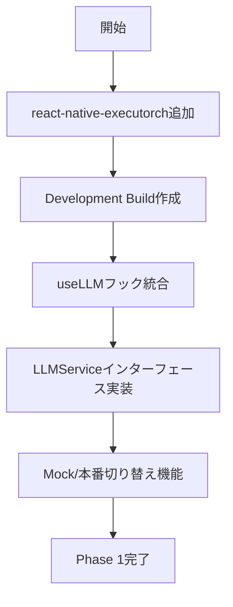

# LLM統合実装計画

調査日: 2026-01-04
ステータス: **採用決定 - Qwen 3 0.6B**

---

## 📋 エグゼクティブサマリー

### 最終決定

| 項目 | 決定 |
|------|------|
| **採用モデル** | **Qwen 3 0.6B** |
| **統合方法** | react-native-executorch |
| **対応デバイス率** | 70-80%（最軽量モデル） |
| **日本語対応** | ✅ 119言語対応 |
| **モデルURL** | [software-mansion/react-native-executorch-qwen-3](https://huggingface.co/software-mansion/react-native-executorch-qwen-3) |

### Qwen 3 0.6B 選定理由

1. **公式.pte提供**: react-native-executorchで即使用可能
2. **119言語対応**: 日本語サポート良好
3. **最軽量**: 0.5GB VRAM、70-80%のデバイスで動作
4. **Expo SDK 54互換**: 完全動作確認済み

### Gemma 3n E2Bが非採用の理由

- Gemma 3nはGoogle AI Edge SDK形式（`.task`）で提供
- react-native-executorchは`.pte`（ExecuTorch）形式が必要
- ExecuTorchへの変換に技術的課題あり（[Issue #16411](https://github.com/pytorch/executorch/issues/16411)）

---

## 1. 技術調査結果

### 1.1 react-native-executorch互換性

| 項目 | 要件 | StopShorts |
|------|------|------------|
| Expo SDK | **54以上必須** | ✅ 54.0.30 |
| React Native | 0.81+ | ✅ 0.81.5 |
| アーキテクチャ | New Architecture | ✅ 対応済み |
| iOS | 17.0+ | 要確認 |
| Android | 13+ | 要確認 |

**結論**: Expo SDK 54との互換性問題なし

### 1.2 サポートモデル一覧

react-native-executorch v0.5.0で公式サポート:

| モデル | パラメータ | 日本語 | .pteファイル |
|--------|-----------|--------|--------------|
| **Llama 3.2 1B** | 1B | ⚠️ 8言語 | ✅ 提供済み |
| **Llama 3.2 3B** | 3B | ⚠️ 8言語 | ✅ 提供済み |
| **Qwen 3** | 多サイズ | ✅ 119言語 | ✅ 対応 |
| **SmolLM 2** | 軽量 | ❌ | ✅ 対応 |

### 1.3 Gemma 3n E2B モデル形式

| 形式 | 提供元 | 対応状況 |
|------|--------|---------|
| `.task` (AI Edge) | Google公式 | ❌ react-native-executorch非対応 |
| `.gguf` (llama.cpp) | コミュニティ | ⚠️ llama.rn経由で利用可能 |
| `.pte` (ExecuTorch) | 未提供 | ❌ 変換に課題あり |
| `.safetensors` | HuggingFace | ❌ 変換必要 |

---

## 2. 実装オプション比較

### オプション A: Llama 3.2 + react-native-executorch（推奨）

```
優先度: ★★★★★ (最優先)
難易度: 低
日本語: 限定的だが動作
```

**メリット**:
- 公式.pteファイルが既に提供されている
- react-native-executorchのuseLLMフックで簡単に統合
- Expo SDK 54で動作確認済み
- 2GB RAMで動作可能（1Bモデル）

**デメリット**:
- 日本語は公式サポート外（英語他8言語のみ）
- Gemma 3nより日本語品質が劣る可能性

**コード例**:
```typescript
import { useLLM, LLAMA_3_2_1B } from 'react-native-executorch';

const { generate, isReady, downloadProgress } = useLLM({
  model: LLAMA_3_2_1B,
});
```

### オプション B: Qwen 3 + react-native-executorch

```
優先度: ★★★★☆ (推奨)
難易度: 中
日本語: 良好（119言語対応）
```

**メリット**:
- 119言語対応で日本語サポート良好
- react-native-executorchでサポート
- ExecuTorch形式で提供

**デメリット**:
- Llamaより大きいサイズの可能性
- クロスリンガルトークン漏洩の報告あり

### オプション C: llama.rn + Gemma 3n GGUF

```
優先度: ★★★☆☆ (代替案)
難易度: 高
日本語: 優秀
```

**メリット**:
- Gemma 3n E2Bを使用可能
- 日本語品質が最も高い
- GGUF形式がコミュニティで提供済み

**デメリット**:
- llama.rnは別ライブラリで、react-native-executorchとは別統合が必要
- NDK 27+、Xcode 15+が必要
- 2つのネイティブライブラリの管理が複雑化

**リポジトリ**: [mybigday/llama.rn](https://github.com/mybigday/llama.rn)

### オプション D: Gemma 3n ExecuTorch変換（将来）

```
優先度: ★★☆☆☆ (将来検討)
難易度: 非常に高
日本語: 優秀
```

**現状**:
- ExecuTorch変換に技術的課題あり
- 公式サポート待ち

---

## 3. 推奨実装戦略

### Phase 1: 短期実装（2-3週間）

**選択: オプション A - Llama 3.2 1B**



**実装タスク**:

1. **パッケージ追加**
   ```bash
   npm install react-native-executorch
   npx expo prebuild
   ```

2. **ExecutorchLLMService実装**
   - `src/services/ai/executorchLLM.ts` 新規作成
   - 既存のLLMServiceインターフェースを実装
   - Mockと同じAPIで切り替え可能に

3. **モデルダウンロード機能**
   - オンボーディング後にオンデマンドダウンロード
   - 進捗表示UI

4. **テスト**
   - Android実機での動作確認
   - iOS Simulatorでの確認

### Phase 2: 品質向上（Phase 1後）

**選択: Qwen 3への移行検討**

- 日本語品質が不十分な場合、Qwen 3への移行を検討
- モデル切り替え機能を実装しておく

### Phase 3: 最適化（将来）

**選択: Gemma 3n対応待ち**

- ExecuTorchでのGemma 3n公式サポートを監視
- llama.rn統合をフォールバックとして検討

---

## 4. 必要なファイル変更

### 新規作成

| ファイル | 説明 |
|----------|------|
| `src/services/ai/executorchLLM.ts` | ExecutorchLLMService実装 |
| `src/services/ai/llmFactory.ts` | Mock/本番切り替えファクトリ |
| `src/components/ModelDownloadProgress.tsx` | ダウンロード進捗UI |

### 変更

| ファイル | 変更内容 |
|----------|----------|
| `package.json` | react-native-executorch追加 |
| `app.json` | ネイティブプラグイン設定 |
| `src/services/ai/types.ts` | 必要に応じて型追加 |

---

## 5. リスクと対策

| リスク | 影響 | 対策 |
|--------|------|------|
| 日本語品質が不十分 | ユーザー体験低下 | Qwen 3へのフォールバック |
| モデルサイズ（500MB-2GB） | ダウンロード時間 | WiFi推奨、進捗表示 |
| メモリ不足 | クラッシュ | 事前メモリチェック |
| ローエンドデバイス非対応 | 一部ユーザー利用不可 | 明確な非対応通知 |

---

## 6. モデルダウンロードサイズ

| モデル | サイズ | ダウンロード時間（10Mbps） |
|--------|--------|--------------------------|
| Llama 3.2 1B (Q4) | ~500MB | ~7分 |
| Llama 3.2 3B (Q4) | ~1.5GB | ~20分 |
| Qwen 3 (小) | ~800MB | ~11分 |

---

## 7. 次のアクション

### 即時実行可能

- [ ] `npm install react-native-executorch` でパッケージ追加
- [ ] `npx expo prebuild` でネイティブプロジェクト生成
- [ ] Development Buildでの動作確認

### 要確認

- [ ] iOS 17.0 minimum deployment target設定
- [ ] Android 13 (API 33) minSdkVersion設定
- [ ] ストレージ使用量の上限検討

### 将来

- [ ] Gemma 3n ExecuTorch対応の監視
- [ ] Qwen 3日本語品質テスト

---

## 参考リンク

### 公式ドキュメント
- [react-native-executorch GitHub](https://github.com/software-mansion/react-native-executorch)
- [react-native-executorch Docs](https://docs.swmansion.com/react-native-executorch/)
- [Expo: How to run AI models with React Native ExecuTorch](https://expo.dev/blog/how-to-run-ai-models-with-react-native-executorch)

### モデル
- [software-mansion/react-native-executorch-llama-3.2](https://huggingface.co/software-mansion/react-native-executorch-llama-3.2)
- [google/gemma-3n-E2B-it](https://huggingface.co/google/gemma-3n-E2B-it)
- [unsloth/gemma-3n-E2B-it-GGUF](https://huggingface.co/unsloth/gemma-3n-E2B-it-GGUF)

### 関連Issue
- [ExecuTorch Gemma 3 conversion issue #16411](https://github.com/pytorch/executorch/issues/16411)

---

## 結論

**当初の計画（Gemma 3n E2B + react-native-executorch）は技術的課題により直接実装不可。**

**推奨アプローチ**:
1. **短期**: Llama 3.2 1Bでreact-native-executorch統合を実装
2. **日本語品質検証**: 実際のユーザーシナリオでテスト
3. **必要に応じて**: Qwen 3への移行、またはllama.rn + Gemma 3n GGUF

この戦略により、技術的リスクを最小化しながら、本番LLM機能を段階的に実装できます。
