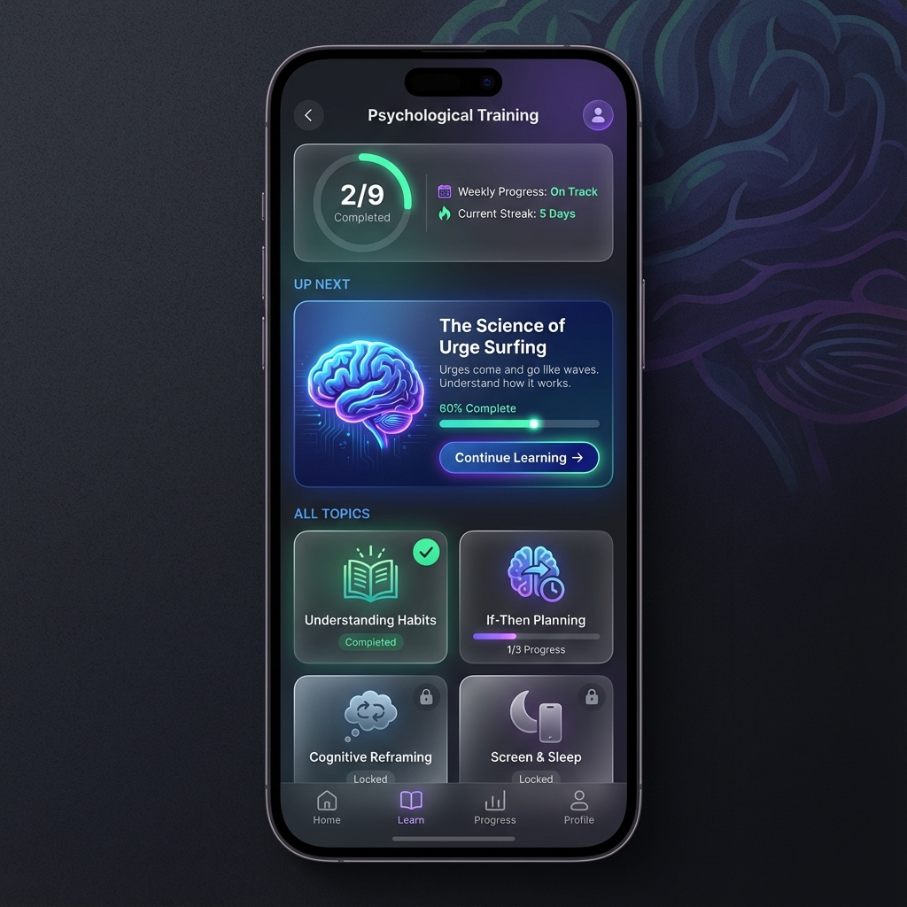

# Training UI Refresh - Design

## 参考: Geminiモックアップ



**採用する要素:**
- 進捗リング（円形プログレス）+ 統計情報
- 「次におすすめ」フィーチャーカード（大きなイラスト付き）
- 2列グリッドレイアウト
- ステータスバッジ（完了/進行中/未開始）

**調整が必要な要素:**
- カラースキーム → StopShorts「Ink & Paper」に変更
- ボトムナビ → そのまま使用（StopShortsは6タブ: Home/Stats/AI/Training/Settings/Profile）
- Locked状態 → 削除（全トピックアクセス可能）
- 雰囲気 → サイバーパンク → Editorial Wellness Journal

---

## 1. トピック一覧画面（リデザイン案）

### 1.1 現状 vs 新デザイン

**現状の問題:**
```
┌─────────────────────────────────────────┐
│ ← 心理トレーニング                        │
├─────────────────────────────────────────┤
│  ┌─────────────────────────────────┐    │
│  │ 2 完了 │ 9 全体 │ 0 ストリーク   │    │  ← 数字だけで意味不明
│  └─────────────────────────────────┘    │
│                                         │
│  📚 科学的知識                           │  ← カテゴリ分けが視覚的に弱い
│  3 トピック                              │
│                                         │
│  ┌─────────────────────────────────┐    │
│  │ 習慣ループの理解            ✓   │    │  ← 詰め込みすぎ
│  │ なぜ習慣は自動的に繰り返され...  │    │
│  │ 🕐 15分  📄 2/3               │    │
│  │ ████░░░░░░░░░░░░░░░░░░░░░░░░  │    │  ← 進捗バー細すぎ
│  └─────────────────────────────────┘    │
│  ...                                    │
└─────────────────────────────────────────┘
```

### 1.2 新デザイン案（StopShortsスタイル適用）

**カラーパレット（Ink & Paper）:**
- 背景: `colors.background` (クリーム/ダーク)
- カード: `colors.backgroundCard`
- アクセント: `colors.accent` (#C65D3B テラコッタ)
- 進捗バー: カテゴリ色 (primary/accent/success)

```
┌─────────────────────────────────────────┐
│ ← 心理トレーニング                        │  ← Header (ghost variant)
├─────────────────────────────────────────┤
│  背景: colors.background                 │
│                                         │
│  ┌─────────────────────────────────┐    │
│  │  ╭───────╮                      │    │
│  │  │       │   週間進捗: 順調      │    │  ← 進捗リング（SVG）
│  │  │  2/9  │   ストリーク: 5日     │    │     colors.accent で描画
│  │  │ 完了  │                      │    │
│  │  ╰───────╯                      │    │
│  └─────────────────────────────────┘    │  ← backgroundCard
│                                         │
│  次におすすめ                            │  ← typography.label, textMuted
│                                         │
│  ┌─────────────────────────────────┐    │
│  │                                 │    │
│  │  ╭─────╮                        │    │
│  │  │ 🧠  │  衝動サーフィンの科学   │    │  ← トピックアイコン + h3
│  │  ╰─────╯                        │    │
│  │                                 │    │
│  │  衝動は波のように来て去る。      │    │  ← bodySmall, textSecondary
│  │  その仕組みを理解しよう。        │    │
│  │                                 │    │
│  │  ━━━━━━━━━━░░░░░░░░  60%       │    │  ← 進捗バー（accent色）
│  │                                 │    │
│  │         [ 続きを学ぶ → ]        │    │  ← Button (primary)
│  │                                 │    │
│  └─────────────────────────────────┘    │  ← backgroundCard, border accent
│                                         │
│  すべてのトピック                        │
│                                         │
│  ┌────────────┐  ┌────────────┐         │
│  │            │  │            │         │
│  │    📚     │  │    🧠     │         │  ← アイコン（大）
│  │            │  │            │         │
│  │ 習慣ループ  │  │ If-Then    │         │  ← h4, textPrimary
│  │ の理解     │  │ プラン     │         │
│  │            │  │            │         │
│  │ ━━━━━━━━  │  │ ━━━░░░░░  │         │  ← 進捗バー（小）
│  │            │  │            │         │
│  │ ✓ 完了    │  │ 1/3 進行中 │         │  ← ステータスバッジ
│  │            │  │            │         │
│  └────────────┘  └────────────┘         │
│  緑背景+border  │  accent border        │
│                                         │
│  ┌────────────┐  ┌────────────┐         │
│  │            │  │            │         │
│  │    💭     │  │    🌙     │         │
│  │            │  │            │         │
│  │ 認知       │  │ スクリーン │         │
│  │ リフレーム │  │ と睡眠     │         │
│  │            │  │            │         │
│  │ ░░░░░░░░  │  │ ░░░░░░░░  │         │  ← 進捗0%
│  │            │  │            │         │
│  │   未開始   │  │   未開始   │         │  ← textMuted
│  │            │  │            │         │
│  └────────────┘  └────────────┘         │
│  通常border                             │
│                                         │
└─────────────────────────────────────────┘
```

**ステータス別カードスタイル:**
| 状態 | 背景 | ボーダー | バッジ色 |
|------|------|---------|---------|
| 未開始 | backgroundCard | border | textMuted |
| 進行中 | backgroundCard | accent | accent |
| 完了 | success+10% | success | success |

---

## 2. カードデザイン詳細

### 2.1 フィーチャーカード（次におすすめ）

```
┌─────────────────────────────────────────┐
│                                         │
│  ┌───┐                                  │
│  │🧠 │  衝動サーフィンの科学             │   大アイコン + タイトル
│  └───┘                                  │
│                                         │
│  衝動は波のように来て去ります。           │   説明文（2行まで）
│  その仕組みを理解して、乗りこなそう。     │
│                                         │
│  ━━━━━━━━━━━░░░░░░░░░░░░ 60%           │   進捗バー（大）
│                                         │
│  🕐 15分     📄 2/3 コンテンツ          │   メタ情報
│                                         │
│                    [ 続きを学ぶ → ]     │   CTA ボタン
│                                         │
└─────────────────────────────────────────┘

状態別:
- 未開始: 「学習を始める →」
- 進行中: 「続きを学ぶ →」
- 完了済: ✓アイコン + 「復習する」
```

### 2.2 グリッドカード（一覧）

```
┌──────────────────┐
│                  │
│       📚        │   アイコン（大）
│                  │
│   習慣ループ     │   タイトル（2行まで）
│   の理解         │
│                  │
│   ━━━━━━░░░     │   進捗バー（小）
│                  │
│   ✓ 完了        │   ステータス
│                  │
└──────────────────┘

状態別カラー:
- 未開始: border = colors.border
- 進行中: border = colors.accent (アクセント)
- 完了済: background = colors.success + '10'
```

---

## 3. トピック詳細画面

### 3.1 現状

```
┌─────────────────────────────────────────┐
│ ← 習慣ループの理解                        │
├─────────────────────────────────────────┤
│                                         │
│  [リスト形式でコンテンツが並ぶ]           │
│                                         │
│  1. 記事: 習慣ループとは                 │
│  2. クイズ: 理解度チェック               │
│  3. ワークシート: 自分の習慣を分析        │
│                                         │
└─────────────────────────────────────────┘
```

### 3.2 新デザイン案

```
┌─────────────────────────────────────────┐
│ ← 習慣ループの理解                        │
├─────────────────────────────────────────┤
│                                         │
│  ┌─────────────────────────────────┐    │
│  │         📚                      │    │
│  │                                 │    │
│  │   なぜ習慣は自動的に             │    │
│  │   繰り返されるのか？             │    │
│  │                                 │    │
│  │   ━━━━━━━━░░░░  2/3 完了       │    │
│  │                                 │    │
│  └─────────────────────────────────┘    │
│                                         │
│  学習コンテンツ                          │
│  ─────────────────────────────────────  │
│                                         │
│  ┌─────────────────────────────────┐    │
│  │ ✓  📖 習慣ループとは            │    │  ← 完了済み
│  │     基礎知識を学ぶ              │    │
│  │                      5分 →     │    │
│  └─────────────────────────────────┘    │
│                                         │
│  ┌─────────────────────────────────┐    │
│  │ ○  🧪 理解度クイズ              │    │  ← 次のコンテンツ（アクティブ）
│  │     学んだことを確認             │    │
│  │                      3分 →     │    │
│  └─────────────────────────────────┘    │
│                                         │
│  ┌─────────────────────────────────┐    │
│  │ ○  📝 自分の習慣を分析          │    │  ← ロック状態
│  │     ワークシートで実践           │    │
│  │                      7分 →     │    │
│  └─────────────────────────────────┘    │
│                                         │
└─────────────────────────────────────────┘

アイコン凡例:
- 📖 = 記事（article）
- 🧪 = クイズ（quiz）
- 📝 = ワークシート（worksheet）
```

---

## 4. コンテンツアイコンマッピング

| コンテンツタイプ | アイコン | 色 |
|-----------------|---------|-----|
| article | `book-outline` | primary |
| quiz | `flask-outline` | accent |
| worksheet | `document-text-outline` | success |

---

## 5. カテゴリアイコンマッピング

| カテゴリ | アイコン | 説明 |
|---------|---------|------|
| research | `school-outline` | 科学的知識 |
| emotional | `heart-outline` | 感情管理 |
| goal | `flag-outline` | 目標設定 |

---

## 6. アニメーション

### 6.1 トピック完了時

```
1. チェックマークアニメーション（ポップイン）
2. カード背景色が緑にフェード
3. 紙吹雪（オプション、P3）
```

### 6.2 コンテンツ完了時

```
1. チェックマークがスライドイン
2. 次のコンテンツがアンロック（ボーダー色変更）
```

---

## 7. 実装ファイル

| ファイル | 役割 |
|----------|------|
| `app/(main)/training/index.tsx` | トピック一覧（リデザイン） |
| `app/(main)/training/[topicId].tsx` | トピック詳細（リデザイン） |
| `src/components/training/FeatureTopicCard.tsx` | フィーチャーカード（新規） |
| `src/components/training/TopicGridCard.tsx` | グリッドカード（新規） |
| `src/components/training/ContentListItem.tsx` | コンテンツリストアイテム（新規） |
| `src/components/training/ProgressRing.tsx` | 進捗リング（新規） |
